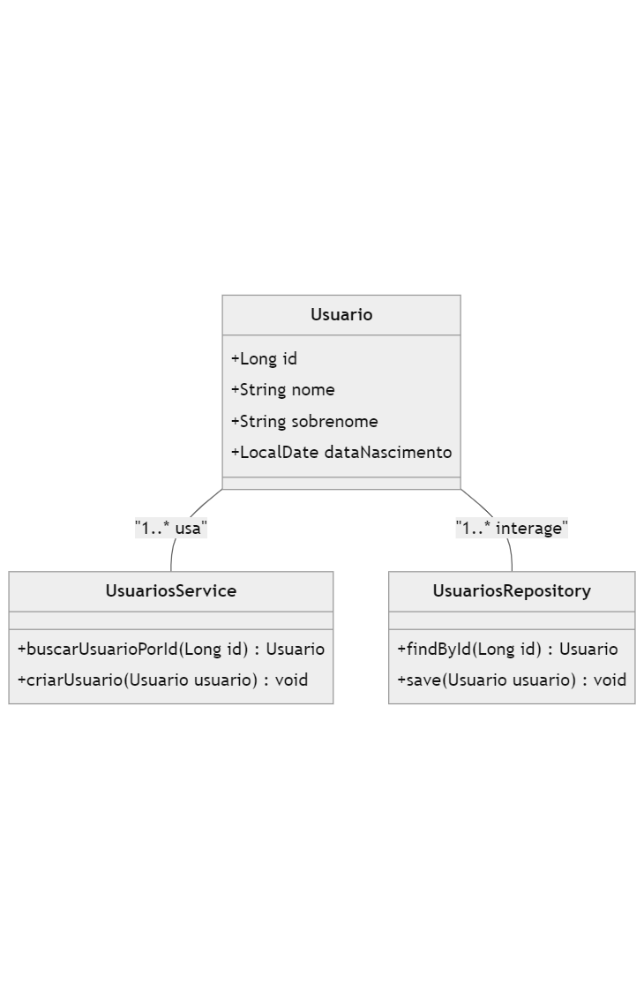
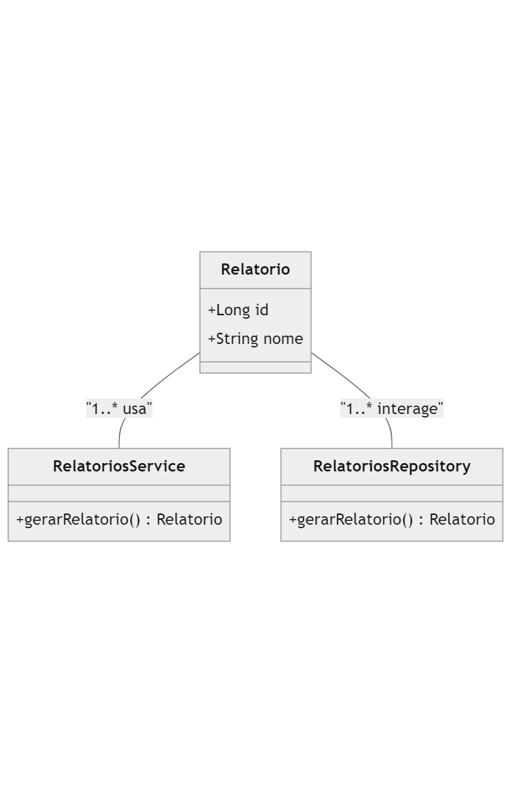
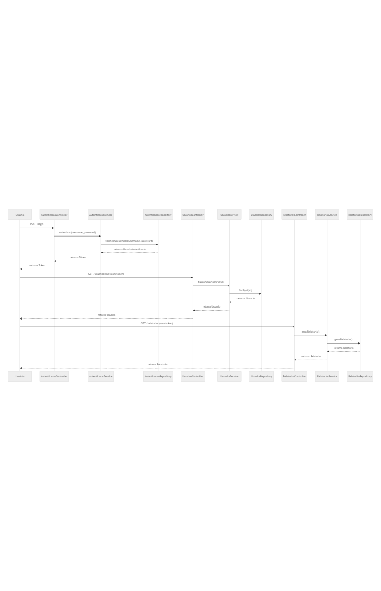

# Gerenciador de Usuários - APIs com Docker, Kubernetes e CI/CD

## Descrição
Este projeto implementa um sistema de Gerenciamento de Usuários utilizando uma arquitetura de **microserviços**. O sistema é composto por três APIs independentes:
1. **UsuariosAPI** - Gerencia o cadastro e consulta de usuários.
2. **RelatoriosAPI** - Gera relatórios com base nos dados dos usuários.
3. **AutenticacaoAPI** - Gerencia a autenticação e autorização dos usuários.

O projeto utiliza **Docker** para a criação dos contêineres e **Kubernetes** para orquestrar e escalar as APIs. Ele também conta com um pipeline de **CI/CD** para automação de builds e deploys.

## Tecnologias Utilizadas
- **Java 17** e **Spring Boot**
- **Docker** e **Docker Compose**
- **Kubernetes (Minikube para desenvolvimento local)**
- **CI/CD  GitHub Actions**
- **JUnit 5** para testes unitários
- **Lombok** para simplificação do código
- **H2 Database** (banco de dados em memória para testes)

## Diagrama de Classes

### UsuariosAPI - Diagrama de Classe


### RelatoriosAPI - Diagrama de Classe


### AutenticacaoAPI - Diagrama de Classe


## Diagrama de Sequência do Sistema
Este diagrama mostra a interação entre as três APIs (UsuariosAPI, RelatoriosAPI e AutenticacaoAPI).



## Requisitos de Sistema
Certifique-se de que as seguintes ferramentas estão instaladas em sua máquina:
- **Docker**: [Instruções de instalação](https://docs.docker.com/get-docker/)
- **Docker Compose**: [Instruções de instalação](https://docs.docker.com/compose/install/)
- **Minikube** (para rodar Kubernetes localmente): [Instruções de instalação](https://minikube.sigs.k8s.io/docs/start/)
- **Maven**: [Instruções de instalação](https://maven.apache.org/install.html)
- **Java 17 (JDK)**: [Instruções de instalação](https://openjdk.java.net/install/)

## Configuração do Projeto
1. Clone o repositório:
   ```bash
   git clone https://github.com/seu-usuario/seu-repositorio.git
   cd seu-repositorio
   ```

2. Construa o projeto usando Maven:
   ```bash
   mvn clean install
   ```

### Subir o Sistema com Docker Compose
1. Construa e suba os contêineres Docker:
   ```bash
   docker-compose up --build
   ```

2. As APIs estarão disponíveis nas seguintes portas:
   - **UsuariosAPI**: [http://localhost:8080](http://localhost:8080)
   - **RelatoriosAPI**: [http://localhost:8081](http://localhost:8081)
   - **AutenticacaoAPI**: [http://localhost:8082](http://localhost:8082)

3. Para parar e remover os contêineres:
   ```bash
   docker-compose down
   ```

### Subir o Sistema com Kubernetes (Minikube)
1. Inicie o Minikube:
   ```bash
   minikube start
   ```

2. Configure o Docker para usar o ambiente do Minikube:
   ```bash
   eval $(minikube docker-env)
   ```

3. Construa as imagens Docker para o Minikube:
   ```bash
   docker build -t usuarios-api ./UsuariosAPI
   docker build -t relatorios-api ./RelatoriosAPI
   docker build -t autenticacao-api ./AutenticacaoAPI
   ```

4. Aplique os arquivos YAML de deployment no Kubernetes:
   ```bash
   kubectl apply -f k8s/usuarios-api-deployment.yml
   kubectl apply -f k8s/relatorios-api-deployment.yml
   kubectl apply -f k8s/autenticacao-api-deployment.yml
   ```

5. Verifique o status dos pods:
   ```bash
   kubectl get pods
   ```

6. Acesse as APIs via Minikube:
   Para obter o IP do Minikube:
   ```bash
   minikube ip
   ```

   Combine o IP retornado com as portas configuradas nos serviços para acessar as APIs:
   - **UsuariosAPI**: `http://<minikube-ip>:<NodePort>`
   - **RelatoriosAPI**: `http://<minikube-ip>:<NodePort>`
   - **AutenticacaoAPI**: `http://<minikube-ip>:<NodePort>`

7. Para parar o Minikube:
   ```bash
   minikube stop
   ```

### Testes Unitários
Para rodar os testes unitários do projeto:
```bash
mvn test
```

### CI/CD
Este projeto está configurado para um pipeline de CI/CD que automatiza o processo de build, testes e deployment.
- O pipeline pode ser configurado em **GitHub Actions**.
- O pipeline executa os testes unitários, constrói a imagem Docker e publica no **Docker Hub** automaticamente.

## Estrutura do Projeto
```bash
├── UsuariosAPI/
│   ├── src/          # Código-fonte da API de usuários
│   ├── Dockerfile    # Arquivo Docker para a API de usuários
│   └── pom.xml       # Arquivo Maven
├── RelatoriosAPI/
│   ├── src/          # Código-fonte da API de relatórios
│   ├── Dockerfile    # Arquivo Docker para a API de relatórios
│   └── pom.xml       # Arquivo Maven
├── AutenticacaoAPI/
│   ├── src/          # Código-fonte da API de autenticação
│   ├── Dockerfile    # Arquivo Docker para a API de autenticação
│   └── pom.xml       # Arquivo Maven
├── k8s/              # Arquivos de configuração para Kubernetes
│   ├── usuarios-api-deployment.yml
│   ├── relatorios-api-deployment.yml
│   └── autenticacao-api-deployment.yml
├── docker-compose.yml
└── README.md
```
